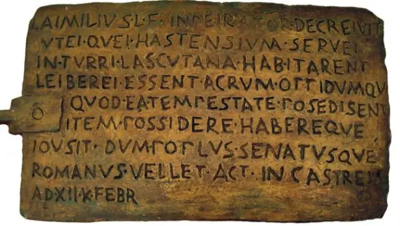
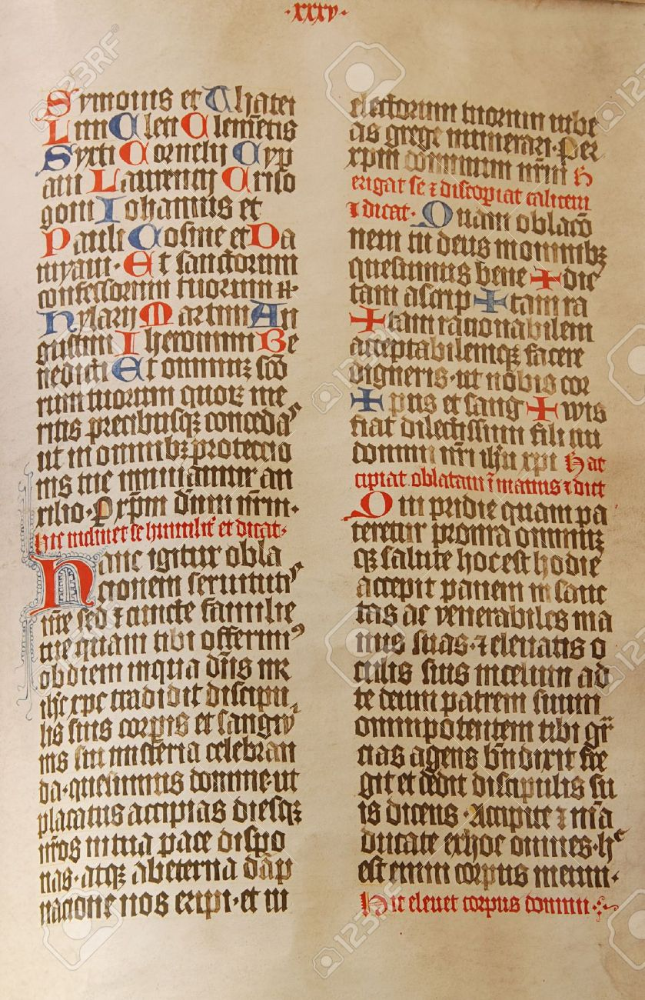
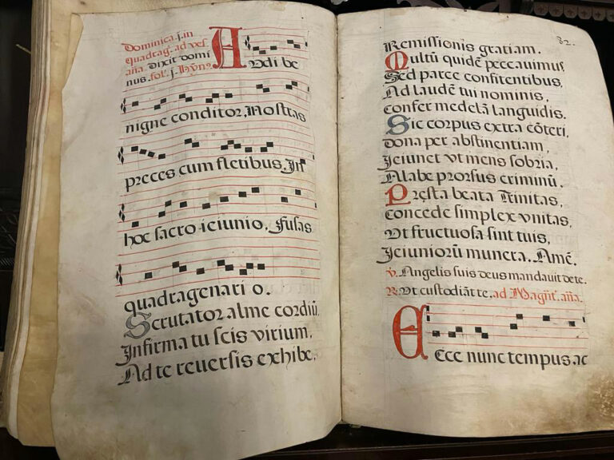

# Desafío 1: Traductor de Lenguas Antiguas

## Objetivo

Implementar un sistema que traduzca textos de lenguas muertas o antiguas al español moderno, facilitando el estudio de documentos históricos.

## Reto

Se proporcionarán 3 textos a traducir:

### Texto 1

### Texto 2

### Texto 3

