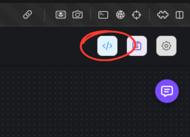
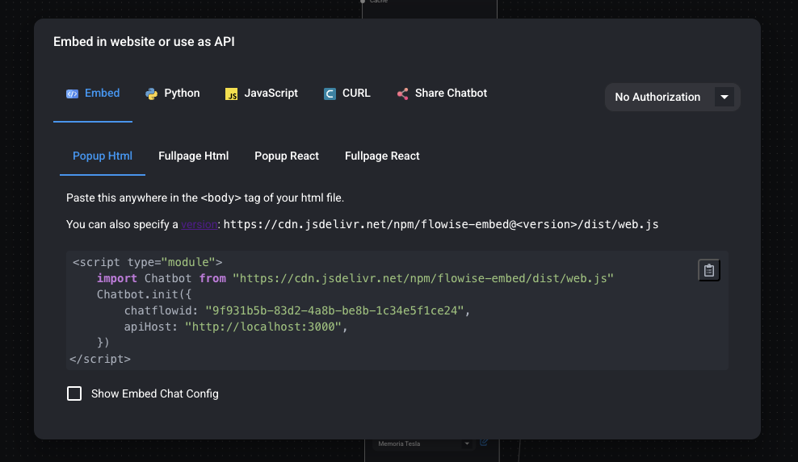

# Parte 4: Despliegue y API

En esta cuarta parte del curso, aprenderemos a desplegar nuestros proyectos de Flowise tanto localmente como en la nube. También exploraremos las diferentes maneras de interactuar con nuestros proyectos, ya sea en forma de chatbot en una página web o como una API integrada en una aplicación.

## Contenidos

* [Despliegue de Chatbot](parte-4.md#qué-es-el-despliegue)
  * [Local](parte-4.md#despliegue-local)
  * [En la nube](parte-4.md#despliegue-en-la-nube)
* [Acceder a nuestros proyectos a través de API](parte-4.md#acceder-a-nuestros-proyectos-a-través-de-api)
* [Configuración Avanzada de Chatbots](parte-4.md#configuración-avanzada-de-chatbots)
* [CURL](parte-4.md#curl)
* [Share](parte-4.md#share)
* [Implementación en JavaScript](parte-4.md#implementación-en-javascript)
* [Implementación en Python](parte-4.md#implementación-en-python)

## ¿Qué es el Despliegue?

El despliegue es el proceso de hacer que nuestro chatbot o proyecto esté disponible para ser usado. Es como "publicar" nuestro proyecto para que otros puedan interactuar con él. Hay dos maneras principales de hacer esto:

### Despliegue Local

El despliegue local significa que nuestro chatbot funciona en nuestra propia computadora. Es ideal para:

* Desarrollo y pruebas
* Uso personal o en una red local
* Proyectos que no necesitan estar disponibles 24/7

Para comenzar a desplegar cualquiera de nuestros proyectos, debemos seleccionar el botón que se encuentra en la esquina superior derecha con un símbolo de embed.



Una vez seleccionado nos encontraremos con un menú con todas las opciones que tenemos para desplegar nuestro proyecto. Todas funcionarán localmente en nuestra máquina.



### Despliegue en la Nube

El despliegue en la nube significa que nuestro chatbot está alojado en servidores de internet. Es ideal para:

* Proyectos que necesitan estar disponibles 24/7
* Chatbots que serán usados por muchas personas
* Aplicaciones que necesitan alta disponibilidad

Puedes desplegar Flowise desde varios proveedores en la nube:

* [Opciones de Despliegue](../documentacion-oficial/configuracion/deployment/)

## Acceder a proyectos a través de API

Una API (Interfaz de Programación de Aplicaciones) es como un "menú de servicios" que permite que otros programas interactúen con nuestro chatbot.

Ventajas de usar la API:

* Integración con otras aplicaciones
* Automatización de procesos
* Personalización completa de la interfaz

Para usar la API de Flowise, necesitarás:

1. Tu API Key
2. El ID de tu chatflow
3. El endpoint correcto

[Documentación oficial de la API](../documentacion-oficial/usar-flowise/api.md)

## Configuración Avanzada de Chatbots

La configuración avanzada te permite personalizar cómo funciona tu chatbot:

* Estilos y apariencia
* Comportamiento del chat
* Manejo de errores
* Límites y restricciones

[Guía de configuración avanzada](../documentacion-oficial/usar-flowise/embed.md)

## CURL

CURL es una herramienta que permite hacer peticiones HTTP desde la línea de comandos. Es útil para:

* Probar tu API rápidamente
* Automatizar tareas
* Debuggear problemas

Ejemplo básico:

```bash
curl -X POST "http://localhost:3000/api/v1/prediction/{chatflowid}" 
-H "Authorization: Bearer {api-key}"
-H "Content-Type: application/json" 
-d '{"question":"Hello", "history":[]}'
```

## Share

La función Share permite compartir tu chatbot con otros de forma fácil:

* Genera un link público
* Permite embeber el chat en otras páginas
* Controla quién puede acceder

[Documentación de Share](../documentacion-oficial/usar-flowise/embed.md#sharing)

## Implementación en JavaScript

JavaScript es uno de los lenguajes más comunes para implementar el chatbot en una página web:

```javascript
async function query(data) {
    const response = await fetch(
        "http://localhost:3000/api/v1/prediction/9f931b5b-83d2-4a8b-be8b-1c34e5f1ce24",
        {
            method: "POST",
            headers: {
                "Content-Type": "application/json"
            },
            body: JSON.stringify(data)
        }
    );
    const result = await response.json();
    return result;
}

query({"question": "Hey, how are you?"}).then((response) => {
    console.log(response);
});
```

[Guía de implementación en JavaScript](../documentacion-oficial/usar-flowise/embed.md#javascript)

## Implementación en Python

Python es ideal para integrar el chatbot en aplicaciones backend o scripts:

```python
import requests

API_URL = "http://localhost:3000/api/v1/prediction/9f931b5b-83d2-4a8b-be8b-1c34e5f1ce24"

def query(payload):
    response = requests.post(API_URL, json=payload)
    return response.json()
    
output = query({
    "question": "Hey, how are you?",
})
```

[Guía de implementación en Python](../documentacion-oficial/usar-flowise/api.md#python)

## Links Relevantes

* [API Reference](../documentacion-oficial/usar-flowise/api.md)
* [Embed Documentation](../documentacion-oficial/usar-flowise/embed.md)
* [Authentication](../documentacion-oficial/configuracion/autorizacion/)
* [Opciones de Despliegue](../documentacion-oficial/configuracion/deployment/)
* [Variables Configuration](../documentacion-oficial/usar-flowise/variables.md)
* [Monitoring](../documentacion-oficial/usar-flowise/monitoring.md)
