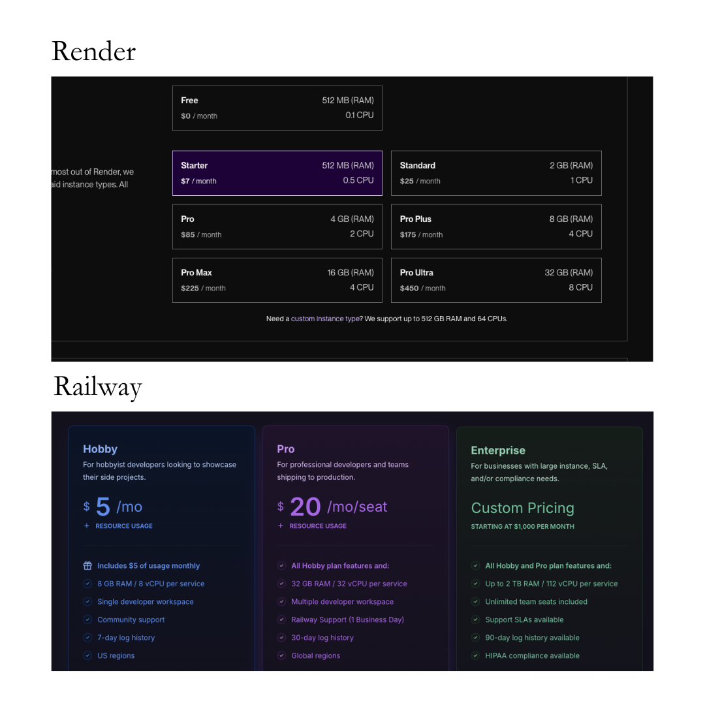
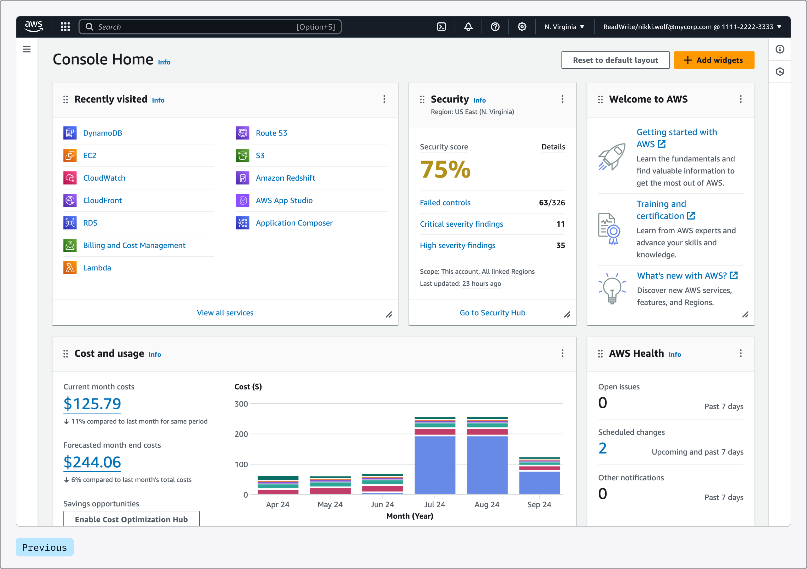

# Parte 4: Despliegue y API

En esta cuarta parte del curso, aprenderemos a desplegar nuestros proyectos de Flowise tanto localmente como en la nube. También exploraremos las diferentes maneras de interactuar con nuestros proyectos, ya sea en forma de chatbot en una página web o como una API integrada en una aplicación.

## Contenidos

- [Opciones de Despliegue](#qué-es-el-despliegue)
  - [Local](#despliegue-local)
  - [En la Nube](#despliegue-en-la-nube)
    - [Proveedores Modernos](#proveedores-modernos)
    - [Cloud Providers Establecidos](#proveedores-establecidos)
  - [Los Proveedores que Recomiendo](#los-proveedores-que-recomiendo)
    - [Proveedores Modernos Recomendados](#proveedores-modernos-recomendados)
    - [Proveedores Establecidos Recomendados](#proveedores-establecidos-recomendados)
  - [Cómo Empezar a Usar Railway](#cómo-empezar-a-usar-railway)
- [¿Qué es una API?](#qué-es-una-api)
- [Acceder a nuestros proyectos a través de API](#acceder-a-nuestros-proyectos-a-través-de-api)
- [Configuración Avanzada de Chatbots](#configuración-avanzada-de-chatbots)
  - [Personalizar Nuestro Chatbot](#personalizar-nuestro-chatbot)
- [CURL](#curl)
- [Share](#share)
- [Implementación en JavaScript](#implementación-en-javascript)
- [Implementación en Python](#implementación-en-python)

## ¿Qué es el Despliegue?

El despliegue es el proceso de hacer que nuestro chatbot o proyecto esté disponible para ser usado. Es como "publicar" nuestro proyecto para que otros puedan interactuar con él. Hay dos maneras principales de hacer esto:

### Despliegue Local

El despliegue local significa que nuestro chatbot funciona en nuestra propia computadora. Es ideal para:
- Desarrollo y pruebas
- Uso personal o en una red local
- Proyectos que no necesitan estar disponibles 24/7

Para comenzar a desplegar cualquiera de nuestros proyectos, debemos seleccionar el botón que se encuentra en la esquina superior derecha con un símbolo de embed.


Una vez seleccionado nos encontraremos con un menú con todas las opciones que tenemos para desplegar nuestro proyecto. Todas funcionarán localmente en nuestra máquina.


### Despliegue en la Nube

El despliegue en la nube significa que nuestro chatbot está alojado en servidores de internet. Es ideal para:
- Proyectos que necesitan estar disponibles 24/7
- Chatbots que serán usados por muchas personas
- Aplicaciones que necesitan alta disponibilidad

Puedes desplegar Flowise desde varios proveedores en la nube:

#### Proveedores modernos

Las proveedores modernos priorizan la amutomatización y se enfocan en developer workflows, simplificando el cloud management y el mantenimiento.

Esto reduce la dificultad para el uso, pero puede limitar el nivel de personalización que tienes sobre la infrastructura.

* [Elestio](https://elest.io/open-source/flowiseai)
* [Hugging Face](hugging-face.md)
* [Railway](railway.md)
* [Render](render.md)
* [Replit](replit.md)
* [RepoCloud](https://repocloud.io/details/?app_id=29)
* [Sealos](sealos.md)
* [Zeabur](zeabur.md)

#### Proveedores establecidos

Los proveedores establecidos, por otro lado, requieren un mayor nivel de expertise técnico para tus necesidades específicas.

Esta complejidad, sin embargo, también te da una mayor flexibilidad y control sobre tu cloud environment.

* [AWS](aws.md)
* [Azure](azure.md)
* [DigitalOcean](digital-ocean.md)
* [GCP](gcp.md)
* [Kubernetes using Helm](https://artifacthub.io/packages/helm/cowboysysop/flowise)

### Los Proveedores que Recomiendo

He provado personalmente todas las alternativas, y tengo dos recomendaciones dependiendo de si preferís un cloud provider más moderno y sencillo de usar o uno más establecido y complejo de usar.

#### Proveedores Modernos Recomendados

Dentro de los proveedores modernos que podemos escoger, en mi opinión las dos mejores opciones son Railway y Render porque combinan buenos precios, sencillez y a la vez de los niveles más altos de libertad para configurar de entre las opciones de proveedores modernos.



En la imagen superior tenemos una comparación entre Render y Railway, y como podemos observar, nos llevamos más por lo que pagamos con Railway, que a la vez es más barato y sencillo de usar, siendo una opción excelente para comenzar a desplegar nuestros proyectos en la nube antes de migrarlos a proveedores más establecidos como AWS.

Por lo que mi recomendación es: **Railway**.

#### Proveedores Establecidos Recomendados

Si ya habéis desplegado alguno de vuestros proyectos en Railway, lo habéis estado probando, lo habéis lanzado al público, y queréis dar el siguiente paso, mi recomendación es AWS.

AWS nos permite tener una escalabilidad elástica, es decir,  ajustar los recursos computacionales dependiendo de la demanda, tiene buenos precios, y es altamente confiable.

**AWS** es la opción que recomiendo si queréis dar un paso más allá de Railway.



### Cómo Empezar a Usar Railway

Para desplegar un proyecto en Railway haz click en el siguiente link:
https://railway.app/template/nEGbjR

Pasos:
1. Haz click en Deploy Now
2. Haz Login con tu cuenta de Github
3. Configura las environment variables de la siguiente manera:

PORT - 3000
LOG_PATH - /opt/railway/.flowise/logs
PASSPHRASE - MYPASSPHRASE
APIKEY_PATH - /opt/railway/.flowise
DATABASE_PATH - /opt/railway/.flowise
SECRETKEY_PATH - /opt/railway/.flowise
FLOWISE_USERNAME - user
FLOWISE_PASSWORD - 1234

4. Haz click en Deploy

## ¿Qué es una API?

Piensa en una API como un camarero en un restaurante. Cuando vas a un restaurante, no vas directamente a la cocina a preparar tu comida - hablas con el camarero. El camarero es la interfaz  (application programming interface) entre tú (el cliente) y la cocina (donde suceden todas las cosas complejas).
Así es como funciona:

Tú (el cliente) miras el menú (la documentación de la API) que te dice qué puedes pedir
Le dices al camarero (la API) lo que quieres usando sus reglas - como decir "Quiero la sopa de pollo, por favor" (haciendo una solicitud a la API)
El camarero lleva tu pedido a la cocina (el sistema backend)
La cocina prepara tu comida (procesa tu solicitud)
El camarero trae de vuelta tu comida (la respuesta de la API)


## Acceder a proyectos a través de API

Una API (Interfaz de Programación de Aplicaciones) es como un "menú de servicios" que permite que otros programas interactúen con nuestro chatbot. 

Ventajas de usar la API:
- Integración con otras aplicaciones
- Automatización de procesos
- Personalización completa de la interfaz

Para usar la API de Flowise, necesitarás:
1. Tu API Key
2. El ID de tu chatflow
3. El endpoint correcto

[Documentación oficial de la API](../../usar-flowise/api.md)

## Configuración Avanzada de Chatbots

La configuración avanzada te permite personalizar cómo funciona tu chatbot:
- Estilos y apariencia
- Comportamiento del chat
- Manejo de errores
- Límites y restricciones  


### Personalizar Nuestro Chatbot

```bash 
<script type="module">
  import Chatbot from 'https://cdn.jsdelivr.net/npm/flowise-embed/dist/web.js';
  Chatbot.init({
    chatflowid: '91e9c803-5169-4db9-8207-3c0915d71c5f',
    apiHost: 'http://localhost:3000',
    chatflowConfig: {
      // topK: 2
    },
    observersConfig: {
      // (optional) Allows you to execute code in parent based upon signal observations within the chatbot.
      // The userinput field submitted to bot ("" when reset by bot)
      observeUserInput: (userInput) => {
        console.log({ userInput });
      },
      // The bot message stack has changed
      observeMessages: (messages) => {
        console.log({ messages });
      },
      // The bot loading signal changed
      observeLoading: (loading) => {
        console.log({ loading });
      },
    },
    theme: {
      button: {
        backgroundColor: '#3B81F6',
        right: 20,
        bottom: 20,
        size: 48, // small | medium | large | number
        dragAndDrop: true,
        iconColor: 'white',
        customIconSrc: 'https://raw.githubusercontent.com/walkxcode/dashboard-icons/main/svg/google-messages.svg',
        autoWindowOpen: {
          autoOpen: true, //parameter to control automatic window opening
          openDelay: 2, // Optional parameter for delay time in seconds
          autoOpenOnMobile: false, //parameter to control automatic window opening in mobile
        },
      },
      tooltip: {
        showTooltip: true,
        tooltipMessage: 'Hi There 👋!',
        tooltipBackgroundColor: 'black',
        tooltipTextColor: 'white',
        tooltipFontSize: 16,
      },
      chatWindow: {
        showTitle: true,
        showAgentMessages: true,
        title: 'Flowise Bot',
        titleAvatarSrc: 'https://raw.githubusercontent.com/walkxcode/dashboard-icons/main/svg/google-messages.svg',
        welcomeMessage: 'Hello! This is custom welcome message',
        errorMessage: 'This is a custom error message',
        backgroundColor: '#ffffff',
        backgroundImage: 'enter image path or link', // If set, this will overlap the background color of the chat window.
        height: 700,
        width: 400,
        fontSize: 16,
        starterPrompts: ['What is a bot?', 'Who are you?'], // It overrides the starter prompts set by the chat flow passed
        starterPromptFontSize: 15,
        clearChatOnReload: false, // If set to true, the chat will be cleared when the page reloads
        sourceDocsTitle: 'Sources:'
        botMessage: {
          backgroundColor: '#f7f8ff',
          textColor: '#303235',
          showAvatar: true,
          avatarSrc: 'https://raw.githubusercontent.com/zahidkhawaja/langchain-chat-nextjs/main/public/parroticon.png',
        },
        userMessage: {
          backgroundColor: '#3B81F6',
          textColor: '#ffffff',
          showAvatar: true,
          avatarSrc: 'https://raw.githubusercontent.com/zahidkhawaja/langchain-chat-nextjs/main/public/usericon.png',
        },
        textInput: {
          placeholder: 'Type your question',
          backgroundColor: '#ffffff',
          textColor: '#303235',
          sendButtonColor: '#3B81F6',
          maxChars: 50,
          maxCharsWarningMessage: 'You exceeded the characters limit. Please input less than 50 characters.',
          autoFocus: true, // If not used, autofocus is disabled on mobile and enabled on desktop. true enables it on both, false disables it on both.
          sendMessageSound: true,
          // sendSoundLocation: "send_message.mp3", // If this is not used, the default sound effect will be played if sendSoundMessage is true.
          receiveMessageSound: true,
          // receiveSoundLocation: "receive_message.mp3", // If this is not used, the default sound effect will be played if receiveSoundMessage is true.
        },
        feedback: {
          color: '#303235',
        },
        footer: {
          textColor: '#303235',
          text: 'Powered by',
          company: 'Flowise',
          companyLink: 'https://flowiseai.com',
        },
        disclaimer: {
          title: 'Disclaimer',
          message: 'By using this chatbot, you agree to the <a target="_blank" href="https://flowiseai.com/terms">Terms & Condition</a>',
        }
      },
    },
  });
</script>
```
## CURL

CURL es una herramienta que permite hacer peticiones HTTP desde la línea de comandos. Es útil para:
- Probar tu API rápidamente
- Automatizar tareas
- Debuggear problemas

Ejemplo básico:
```bash
curl -X POST "http://localhost:3000/api/v1/prediction/{chatflowid}" 
-H "Authorization: Bearer {api-key}"
-H "Content-Type: application/json" 
-d '{"question":"Hello", "history":[]}'
```

## Share

La función Share permite compartir tu chatbot con otros de forma fácil:
- Genera un link público
- Permite embeber el chat en otras páginas
- Controla quién puede acceder

[Documentación de Share](../../usar-flowise/embed.md#sharing)

## Implementación en JavaScript

JavaScript es uno de los lenguajes más comunes para implementar el chatbot en una página web:

```javascript
async function query(data) {
    const response = await fetch(
        "http://localhost:3000/api/v1/prediction/9f931b5b-83d2-4a8b-be8b-1c34e5f1ce24",
        {
            method: "POST",
            headers: {
                "Content-Type": "application/json"
            },
            body: JSON.stringify(data)
        }
    );
    const result = await response.json();
    return result;
}

query({"question": "Hey, how are you?"}).then((response) => {
    console.log(response);
});
```

[Guía de implementación en JavaScript](../../usar-flowise/embed.md#javascript)

## Implementación en Python

Python es ideal para integrar el chatbot en aplicaciones backend o scripts:

```python
import requests

API_URL = "http://localhost:3000/api/v1/prediction/9f931b5b-83d2-4a8b-be8b-1c34e5f1ce24"

def query(payload):
    response = requests.post(API_URL, json=payload)
    return response.json()
    
output = query({
    "question": "Hey, how are you?",
})
```

[Guía de implementación en Python](../../usar-flowise/api.md#python)

## Links Relevantes

- [API Reference](../../usar-flowise/api.md)
- [Embed Documentation](../../usar-flowise/embed.md)
- [Authentication](../../configuracion/autorizacion/README.md)
- [Opciones de Despliegue](../../configuracion/deployment/README.md)
- [Variables Configuration](../../usar-flowise/variables.md)
- [Monitoring](../../usar-flowise/monitoring.md) 