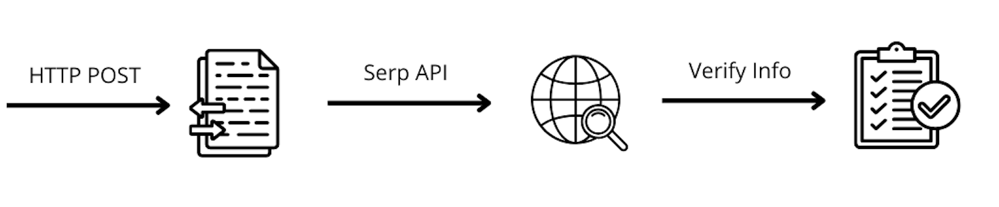

# Desafío 3: Verificador de RAGs

## Objetivo
Crear un agente capaz de llamar a otros proyectos que hayamos hecho y verificar a través de internet. 

## Requisitos
- Capacidad de llamar a otros proyectos nuestros a través de una HTTP POST request.
- Capacidad de buscar información a través de internet.
- Capacidad de contrastar la información obtenida a través del request con la información obtenida a través de internet.

## Reto
Se deberá de verificar si la solución al anterior desafío (Nikola Tesla Chatbot) da respuestas correctas a las preguntas de validación.

Recordatorio de las preguntas de validación del chatbot de Nikola Tesla:
1. ¿En qué ciudad comenzó Tesla a trabajar con Thomas Edison?
2. ¿Qué enfermedad grave sufrió Tesla durante su juventud?
3. ¿Qué nombre le dio Tesla a su torre para experimentos en Long Island?
4. ¿Qué número obsesionaba a Tesla?