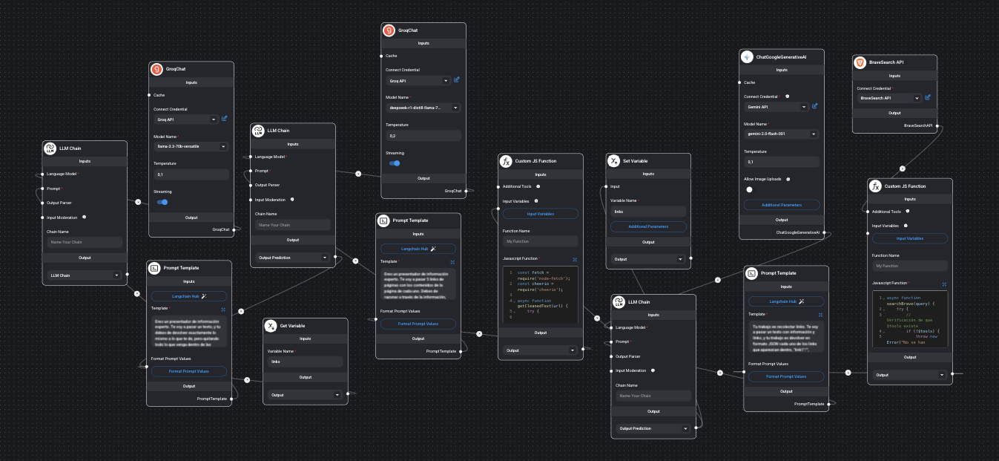
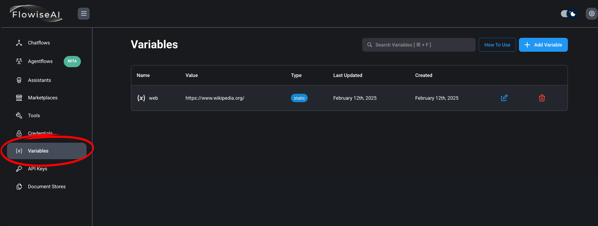
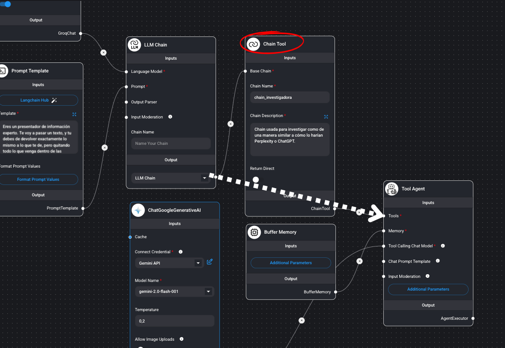
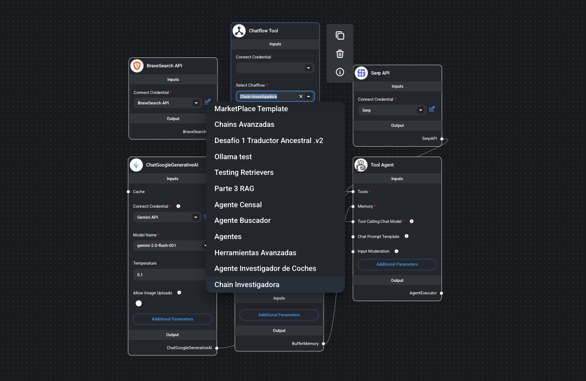
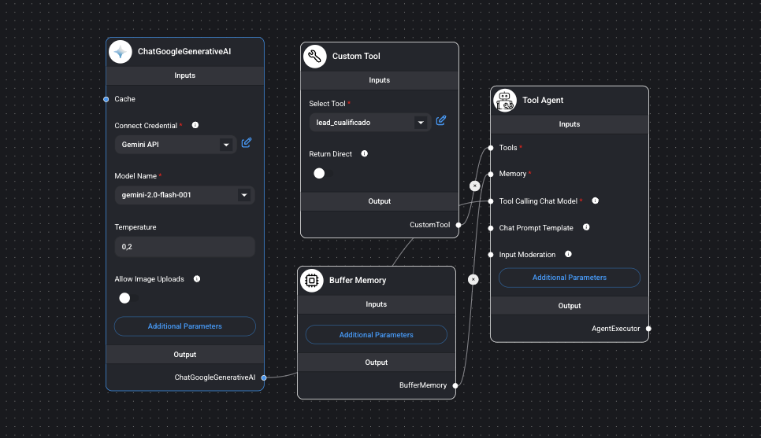
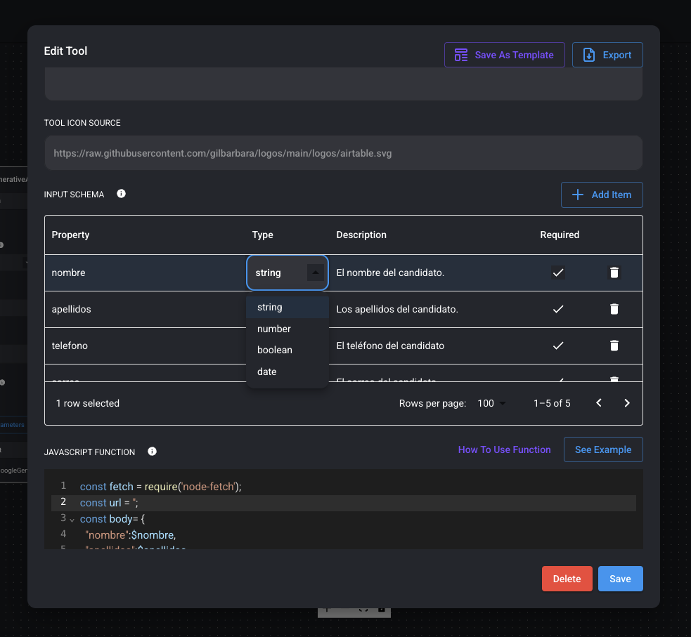
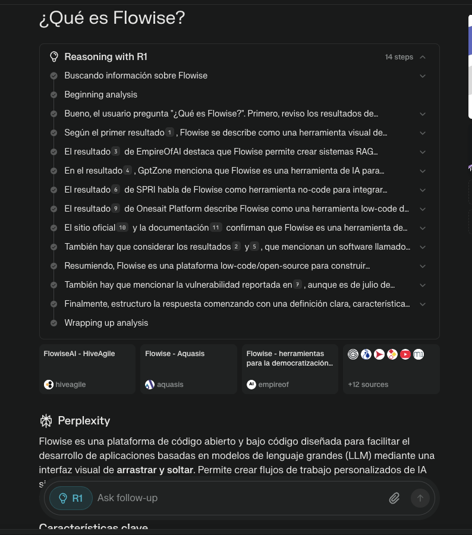
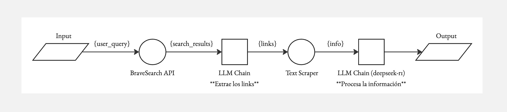

# Parte 6: Agentes, Herramientas, y Principios de Construcción Avanzados

En esta sexta parte comenzaremos a construir nuestros primeros proyectos de gran tamaño y utilidad, como una recreación de Perplexity, que es un buscador web que usa IA para leer páginas y dar respuestas informadas. Veremos los principios de construcción de flows avanzados junto con herramientas y agentes avanzados.

## Contenidos

- [Flujo de la Información](#flujo-de-la-información)
- [Utilities](#utilities)
  - [Variables](#variables)
- [AutoGPT](#autogpt)
- [Herramientas Avanzadas](#herramientas-avanzadas)
  - [Chain Tool](#chain-tool)
  - [Chatflow Tool](#chatflow-tool)
  - [Custom Tool](#custom-tool)
- [Replicando Perplexity](#replicando-perplexity)
  -[Código para la Réplica](#código-para-la-réplica)
    -[Código para usar BraveSearch](#código-para-llamar-a-bravesearch)
    -[Código para hacer Scraping](#código-para-scrapear-las-webs-obtenidas)

## Flujo de la Información

A partir de este punto nuestros workflows solo se harán más complejos, por lo que no nos vendrá mal un entendimiento básico de cómo se transmite la información entre nodos dentro de flowise.

Lo primero es entender que en proyectos grandes la información generalmente fluye desde los nodos que tienen más nodos seguidos conectados desde su output hasta los nodos que menos nodos seguidos tienen conectados desde su output.

¿En el siguiente proyecto cuál es el nodo que recibe la información que el usuario introduce como input, y cuál es el último nodo en recibir información?



La respuesta es que es el nodo que está a la derecha del todo el primero en recibir el input del usuario, y es el que está a la izquierda del todo el último en recibir información. Este diagrama funciona perfectamente, solo que estamos acostumbrados a construir de una manera similar a la que escribimos, para alguien que habla árabe puede que no fuese tan extraño construir así, lo que hay que tener claro, es que la información fluye del nodo que más nodos tenga después de su output al que menos tenga.

## Utilities

### Custom JS Function

Puedes usar las librerías que han sido importadas en Flowise
Puedes usar properties añadidas en el Input Schema como variables con el prefijo $:
Property = userid
Variable = $userid

Puedes usar algunas variables default llamándolas así:

```javascript
$flow.sessionId
$flow.chatId
$flow.chatflowId
$flow.input -> El input del usuario ({{question}})
$flow.state
```
También puedes usar herramientas, conectándolas al nodo y luego llamándolas con:

```javascript
$tools.{tool_name}.invoke{args}
```

### Variables

Las variables pueden usarse en Herramienta Personalizada, Funciones de Javascript, If Else y en el Custom Loader con el prefijo $.

```javascript
$vars.<nombre-de-variable>
```

Las variables también se pueden usar en el parámetro Campo de Texto de cualquier nodo. Por ejemplo, en el Mensaje del Sistema de un Agente:

```javascript
Eres un asistente de IA {{$vars.personality}}
```

Si el tipo de variable es Estática, el valor se recuperará tal cual. Si el tipo de variable es Runtime (tiempo de ejecución), el valor se recuperará del archivo .env.
También puedes sobrescribir los valores de las variables en la API overrideConfig usando 

```javascript
{
    overrideConfig: {
        vars: {
            var1: 'abc'
        }
    }
}
```

Puedes empezar a configurar tus variables a través del menú principal:




## AutoGPT

AutoGPT es un agente autónomo que utiliza un proceso de pensamiento en cadena para completar tareas por sí mismo (tiene la capacidad de usar herramientas). Es como tener un asistente que:

- Piensa paso a paso sobre cómo resolver un problema
- Decide qué acciones tomar
- Ejecuta las acciones necesarias
- Evalúa los resultados
- Ajusta su estrategia según sea necesario


## Herramientas Avanzadas

### Chain Tool

La Chain Tool nos permite introducir algunas de las funcionalidades únicas de las chains como el encadenamiento de chains en nuestros proyectos con agentes.

Una Chain Tool le permite a nuestro agente acceder al output de cualquier chain que construyamos directamente dentro del canvas.



### Chatflow Tool

Una ChatFlow Tool le permite a nuestro agente poder usar cualquiera de los proyectos que hayamos construido en la misma instancia de flowise en la que se encuentre el agente.

A continuación un ejemplo en el que se muestra una ChatFlow tool, donde se puede ver que nos da una lista con los proyectos de nuestra instancia para seleccionar.



### Custom Tool

Una Custom Tool nos permite usar cualquier función que podamos programar en JavaScript como herramienta.



Para las custom tools aplican todos los consejos que vimos del manejo de variables dentro de la sección de Funciones de JavaScript y Variables.

Pero tenemos una sección extra dentro de las herramientas llamada 'Input Schema', en la cual podemos configurar qué variables queremos que la IA aporte como input a la herramienta, el tipo de dato de la variable, la descripción del dato, y si está requerido que no esté vacío.



Finalmente, nos dan un espacio para programar la herramienta, se deben de tener las mismas consideraciones aquí que para la JavaScript Custom Function.

Dejo a continuación un ejemplo de código que se puede usar para mandar datos a un webhook:

```javascript
const fetch = require('node-fetch');
const url = '';
const body= {
  "nombre":$nombre,
  "apellidos":$apellidos,
  "correo":$correo,
  "telefono":$telefono,
  "experiencia":$experiencia
}
const options = {
    method: 'POST',
    headers: {
        'Content-Type': 'application/json'
    },
  body:JSON.stringify(body)
};
try {
    const response = await fetch(url, options);
    const text = await response.text();
    return text;
} catch (error) {
    console.error(error);
    return '';
}
```

Donde declaramos 'url' deberíamos de poner el enlace al webhook, y las variables que aparecen en body son las que mandaríamos.
Se pueden modificar estos campos como se desee.

## Replicando Perplexity

En esta parte crearemos una mini réplica de Perplexity Pro + R1. 

Perplexity es un motor de búsqueda impulsado por IA, el cual lee la información relevante sobre cualquier tópico y responde a las preguntas que tengamos.



Pero hoy vamos a construir nuestra propia versión, y gratuitamente.

Y lo vamos a hacer siguiendo muchos de los principios que hemos aprendido en esta parte.

Dejo a continuación un esquema con el funcionamiento del proyecto que construiremos.



### Código para la Réplica

A continuación, el código necesario para realizar esta réplica.

#### Código para llamar a BraveSearch

```javascript
async function searchBrave(query) {
    try {
        // Verificación de que $tools existe
        if (!$tools) {
            throw new Error("No se han proporcionado herramientas ($tools es undefined). Verifica que el nodo Brave Search esté conectado correctamente.");
        }

        const braveTool = $tools['brave-search'];
        if (!braveTool || typeof braveTool.invoke !== 'function') {
            throw new Error("Herramienta Brave Search no disponible o no conectada correctamente en el flujo");
        }

        if (!query || typeof query !== 'string') {
            throw new Error("Query inválido o vacío");
        }

        console.log("Búsqueda realizada:", query);

        const searchConfig = {
            input: query
        };

        const result = await braveTool.invoke(searchConfig);
        
        // Si el resultado es un string, lo devolvemos directamente
        if (typeof result === 'string') {
            console.log("Resultado obtenido:", result);
            return result;
        }
        
        // Si no, intentamos obtener el toolOutput o convertimos el resultado a string
        const finalResult = result.toolOutput || JSON.stringify(result, null, 2);
        console.log("Resultado obtenido:", finalResult);
        return finalResult;

    } catch (error) {
        console.error("Error detallado:", error.message);
        return `Error en la búsqueda: ${error.message}`;
    }
}

// Verificación inicial de que tenemos acceso a $tools
if (typeof $tools === 'undefined') {
    console.error("Error: $tools no está definido");
    return "Error: Herramientas no disponibles. Verifica la conexión con el nodo Brave Search.";
}

const query = $flow.input;
if (!query) {
    return "Error: No se proporcionó un término de búsqueda";
}

return await searchBrave(query);
```


#### Código para scrapear las webs obtenidas:

```javascript
const fetch = require('node-fetch');
const cheerio = require('cheerio');

async function getCleanedText(url) {
    try {
        console.log(`Iniciando proceso para URL: ${url}`);
        
        const controller = new AbortController();
        const timeout = setTimeout(() => {
            controller.abort();
        }, 10000); 

        console.log('Intentando fetch...');
        const response = await fetch(url, {
            signal: controller.signal,
            headers: {
                'User-Agent': 'Mozilla/5.0 (Windows NT 10.0; Win64; x64) AppleWebKit/537.36 (KHTML, like Gecko) Chrome/91.0.4472.124 Safari/537.36',
                'Accept': 'text/html,application/xhtml+xml,application/xml;q=0.9,image/webp,*/*;q=0.8',
                'Accept-Language': 'en-US,en;q=0.5'
            }
        });
        
        clearTimeout(timeout);

        if (!response.ok) { 
            throw new Error(`HTTP error! Status: ${response.status}`);
        }

        console.log('Fetch exitoso, obteniendo texto...');
        const html = await response.text();
        
        console.log('Cargando contenido en cheerio...');
        const $ = cheerio.load(html);
        
        console.log('Limpiando elementos no deseados...');
        $('script, style, noscript, svg, img, iframe, link').remove();
        
        console.log('Extrayendo texto...');
        const textContent = $('body')
            .find('h1, h2, h3, h4, h5, h6, p, li, td, th, article, section')
            .map((i, el) => {
                const text = $(el).text().trim().replace(/\s+/g, ' ');
                // Log del texto encontrado (primeros 100 caracteres)
                if (text.length > 0) {
                    console.log(`Encontrado texto: ${text.substring(0, 100)}...`);
                }
                return text;
            })
            .get()
            .join('\n\n')
            .replace(/(\n\s*){3,}/g, '\n\n') 
            .trim();

        if (!textContent) {
            console.log('No se encontró texto en la página');
            return 'No se encontró contenido legible en la página';
        }

        console.log(`Procesamiento exitoso para ${url}`);
        return textContent;

    } catch (error) {
        if (error.name === 'AbortError') {
            console.error(`Timeout alcanzado para ${url}`);
            return `Error: La página tardó demasiado en responder`;
        }
        console.error(`Error detallado procesando ${url}:`, error);
        return `Error: ${error.message}`;
    }
}

async function processFirstFiveLinks(jsonString) {
    try {
        console.log('Iniciando procesamiento de links...');
        
        const cleanJsonString = jsonString
            .replace(/^```json\n/, '')
            .replace(/\n```$/, '')
            .trim();

        console.log('JSON limpio:', cleanJsonString.substring(0, 100) + '...');
        
        const links = JSON.parse(cleanJsonString);
        
        const firstFiveEntries = Object.entries(links)
            .filter(([key]) => key.startsWith('link'))
            .slice(0, 5);

        console.log(`Procesando ${firstFiveEntries.length} enlaces...`);
      
        const results = await Promise.all(
            firstFiveEntries.map(async ([linkId, url]) => {
                console.log(`Iniciando procesamiento de ${linkId}...`);
                const text = await getCleanedText(url);
                console.log(`Finalizado procesamiento de ${linkId}`);
                return {
                    linkId,
                    url,
                    text
                };
            })
        );

        console.log('Formateando resultados...');
        const formattedResults = results
            .map(result =>
                `${result.linkId}:\n` +
                `URL: ${result.url}\n` +
                `CONTENIDO:\n${result.text}\n` +
                `----------------------------------------\n`
            )
            .join('\n');

        return formattedResults;
    } catch (error) {
        console.error("Error detallado procesando los enlaces:", error);
        return `Error procesando los enlaces: ${error.message}`;
    }
}

const links = $link;
if (!links) {
    console.error("Variable $link está vacía");
    return "Error: No se proporcionaron enlaces. La variable $link está vacía.";
}

console.log('Iniciando proceso completo...');
return await processFirstFiveLinks(links);

```