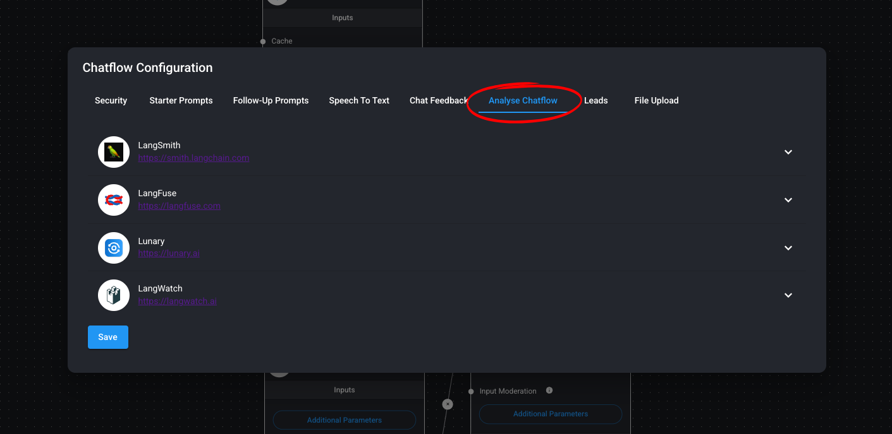

# Parte 7: Integraciones y Plataformas

En esta séptima parte del curso, exploraremos cómo integrar Flowise con algunas plataformas sociales y servicios de automatización, permitiendo llevar nuestros agentes a donde están los usuarios.

## Contenidos

- [Integraciones con Plataformas de Mensajería](#integraciones-con-plataformas-de-mensajería)
- [Análisis de Chatflows]

## Integraciones con Plataformas de Mensajería

### WhatsApp

- Configuración de la Meta Business Suite
[https://business.facebook.com/](https://business.facebook.com/)
- Configuración de WhatsApp Business API
[https://developers.facebook.com/](https://developers.facebook.com/)
- Integración con Make
[https://make.com/](https://make.com/)

### Telegram

- Creación de bots en BotFather
[https://telegram.me/BotFather](https://telegram.me/BotFather)
- Integración con Make
[https://make.com/](https://make.com/)

## Anlálisis de Chatflows

- LangSmith: [https://smith.langchain.com](https://smith.langchain.com)
- LangFuse: [https://langfuse.com/](https://langfuse.com/)

