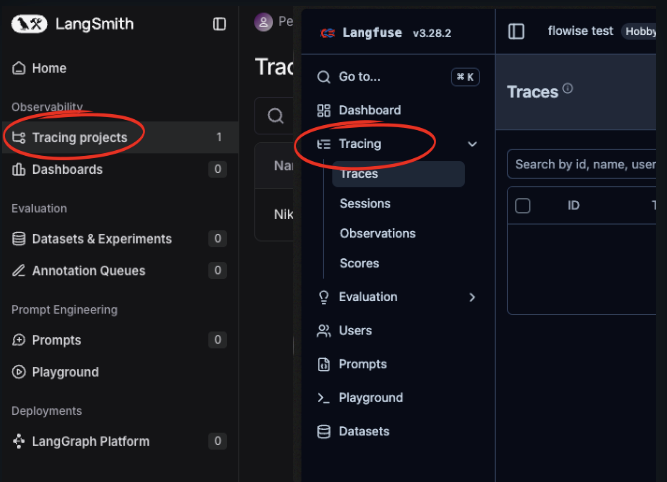

# Parte 7: Integraciones y Plataformas

En esta séptima parte del curso, exploraremos cómo integrar Flowise en plataformas de mensajería como WhatsApp o Telegram. También veremos cómo podemos analizar nuestros chatflows en mayor profundidad usando plataformas como LangSmith o LangFuse.

## Contenidos

- [Integraciones con Plataformas de Mensajería](#integraciones-con-plataformas-de-mensajería)
- [Análisis de Chatflows](#anlálisis-de-chatflows)

## Integraciones con Plataformas de Mensajería

Para poder desplegar nuestros proyectos de Flowise en plataformas como WhatsApp o Telegram tenemos que usar Make.
También necesitaremos tanto una cuenta de Facebook como una cuenta de Telegram.
Deberemos realizar configuraciones dentro de nuestro Meta Business Suite y dentro de Facebook para developers, pero no llevará mucho.
A su vez, para poder usar Telegram solo tenemos que crear un bot dentro de BotFather.

### WhatsApp

- Configuración de la Meta Business Suite
[https://business.facebook.com/](https://business.facebook.com/)
- Configuración de WhatsApp Business API
[https://developers.facebook.com/](https://developers.facebook.com/)
- Integración con Make
[https://make.com/](https://make.com/)

### Telegram

- Creación de bots en BotFather
[https://telegram.me/BotFather](https://telegram.me/BotFather)
- Integración con Make
[https://make.com/](https://make.com/)

## Anlálisis de Chatflows

El análisis de Chatflows es una funcionalidad integrada de Flowise que podemos encontrar dentro de la sección de configuración de cualquiera de nuestros proyectos.

A continuación dejo los enlaces para acceder a las dos herramientas que recomiendo para analizar nuestros chatflows:

- LangSmith: [https://smith.langchain.com](https://smith.langchain.com)
- LangFuse: [https://langfuse.com/](https://langfuse.com/)

Ambas tienen interfaces bastante similares, pero la sección que nos interesa en ambas y que veremos en el vídeo se llama Tracing.

